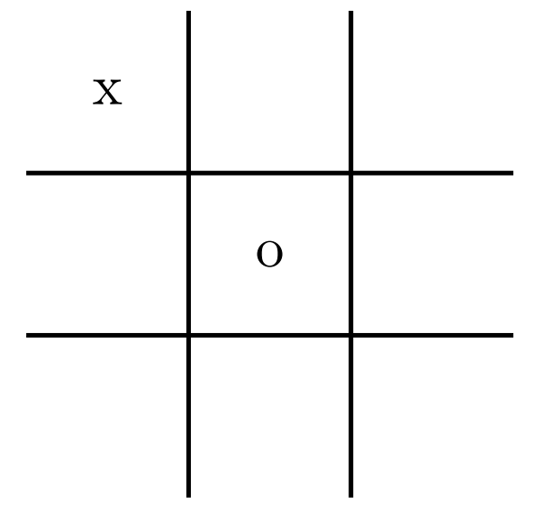

# Fondamentaux de la programmation - Les listes de listes 

## Exercice 1 - Carré magique 

Le but de cette série d'exercice est d'arriver à faire une fonction pour vérifier si un tableau est un carré magique. 

Les règles d'un carrée magique sont les suivantes :

* La somme des nombre de chaque colonne, chaque ligne et des deux diagonales doit être la même
* Le carré doit contenir les nombre de 1 à $N$, où $N$ est le nombre de cases du carré magique.
* Chaque nombre ne doit être présent qu'une et une seule fois.

Pour réaliser une telle fonction, nous allons implémenter plusieurs petites fonctions qui nous combinerons pour arriver à notre objectif.

Commençons par une fonction qui vérifie la somme des éléments d'une ligne d'un tableau (liste de listes).

**Q1.** Écrivez une fonction `somme_ligne(position_ligne, tableau)` qui retourne la somme des éléments de la ligne à `position_ligne` du tableau.

```python
def somme_ligne(position_ligne, tableau):
    """Calcul la somme des éléments de la ligne à <position_ligne> du <tableau>
    :param position_ligne: (int) la position d'une ligne du tableau
    :param tableau: (list) un tableau
    :return: (int) la somme des éléments de la ligne à <position_ligne> du <tableau>"""
```

**Exemple**

```python
>>> tableau = [
	[0,0,0,0,0],
	[0,1,2,3,4],
	[0,2,4,6,8],
	[0,3,6,9,12],
	[0,4,8,12,16]]
>>> somme_ligne(2, tableau)
20
```

La 2ème ligne du tableau est [0,2,4,6,8], ainsi la somme est 0 + 2 + 4 + 6 + 8 = 20.

**Q2.** Écrivez une fonction `somme_colonne(position_ligne, tableau)` qui retourne la somme des éléments de la colonne à `position_colonne` du `tableau`.

**Note:** On garanti que pour les tests les tableaux sont forcément carrés.

```python
def somme_colonne(position_colonne, tableau):
    """Calcul la somme des éléments de la colonne à <position_colonne> du <tableau>
    :param position_colonne: (int) la position d'une colonne du tableau
    :param tableau: (list) un tableau
    :return: (int) la somme des éléments de la colonne à <position_colonne> du <tableau>"""
```

**Exemple**

```python
>>> tableau = [
	[0,0,0,0,0],
	[0,1,2,3,4],
	[0,2,4,6,8],
	[0,3,6,9,12],
	[0,4,8,12,16]]
>>> somme_colonne(1, tableau)
10
```

La colonne à la position 1 du tableau est [0,1,2,3,4], ainsi la somme est 0 + 1 + 2 + 3 + 4 = 10.

**Q3.** Écrivez une  fonction `somme_diagonale(diagonale, tableau)` qui retourne la somme des éléments de la diagonale principale `d` (`d = 0` la  première diagonale partant du coin supérieur gauche au coin inférieur droit, `d = 1` la seconde diagonale partant du coin inférieur gauche au coin supérieur droit). 

**Note:** On garanti que pour les tests les tableaux sont forcément carrés.

```python
def somme_diagonale(diagonale, tableau):
    """Calcul de la somme des éléments sur la <diagonale>. 
    Si <diagonale>=0 c'est la diagonale partant du coin supérieur gauche au coin inférieur droit, 
    Si <diagonale>=1 c'est du coin inférieur gauche au coin supérieur droit.
    :param diagonale: (int) l'identifiant de la diagonale
    :param tableau: (list) un tableau
    :return: (int) la somme des éléments de la <diagonale> du <tableau>"""
```

**Exemple**

```python
>>> tableau = [
[0,0,0,0,0],
[0,1,2,3,4],
[0,2,4,6,8],
[0,3,6,9,12],
[0,4,8,12,16]]
>>> somme_diagonale(0, tableau)
30
```

La diagonale 0 est celle partant du coin supérieur gauche au coin inférieur droit, soit [0,1,4,9,16] donc 0 + 1 + 4 + 9 + 16 = 30

**Q4** Écrivez une fonction `possede_elements_1_a_N(tableau)` qui retourne `True` si le tableau possède les éléments de 1 à $N$ où $N$ est le **nombre de cases** du tableau,  `False`  sinon.

**Note:** On garanti que pour les tests les tableaux sont forcément carrés.

```python
def possede_elements_1_a_N(tableau):
    """Test si tous les éléments de 1 à N sont présent dans le <tableau> où N est le nombre de cases du <tableau>
    :param grille: (list)
    :return: (bool) si tous les éléments de 1 à N sont présent dans le tableau"""
```

**Exemple 1**

```python
>>> tableau = [
	[0,0,0,0,0],
	[0,1,2,3,4],
	[0,2,4,6,8],
	[0,3,6,9,12],
	[0,4,8,12,16]]
>>> possede_elements_1_a_N(tableau)
False
```

Il y a 25 cases dans le tableau, et il manque des éléments : 5, 7, 10, etc.

**Exemple 2**

```python
>>> tableau = [
[1,2,3,4,5],
[6,7,8,9,10],
[11,12,13,14,15],
[16,17,18,19,20],
[21,22,23,24,25]]
>>> possede_elements_1_a_N(tableau)
True
```

**Q5.** Ecrivez une fonction `est_carre_magique(carre_magique)` qui prend en paramètre un carré éventuellement magique, et retourne `True` si c'est bien un carré magique, `False` sinon.

Un carré magique doit respecter les règles suivante :

* La somme des nombre de chaque colonne, chaque ligne et des deux diagonales doit être la même
* Le carré doit contenir les nombre de 1 à $N$, où $N$ est le nombre de cases du carré magique.
* Chaque nombre ne doit être présent qu'une et une seule fois.

```python
def est_carre_magique(carre_magique):
    """Test si la grille <carre_magique> est un carre_magique.
    :param carre_magique: (list)
    :return: (bool) True si c'est un carre_magique, False sinon"""
```
## Exercice 2 - Dessin Textuel

**Q1.** Écrivez une fonction `grille(x,y)` qui créer une liste de `y` listes de `x` points `.`

```python
def grille(x, y):
	"""Retourne une grille de points
	:param x: (int) le nombre de colonnes
	:param y: (int) le nombre de lignes
	:return: (list) une grille de x lignes et y colonnes"""
```

**Exemple **

```python
>>> grille(5, 3)
[['.', '.', '.', '.', '.'], ['.', '.', '.', '.', '.'], ['.', '.', '.', '.', '.']]
```

**Q2.** Écrivez une fonction `afficher_grille(g)` qui prend une liste de listes (une grille) et affiche la grille.
```python
def afficher_grille(g):
	"""Affiche la grille <g>
	:param g: (list) une grille
	:return: (None)"""
```

**Exemple**

```python
>>> afficher_grille(5)
.....
.....
.....
```

**Q3.** Écrivez une fonction `dessiner_point(grille, x, y, symbole)` qui modifie la grille en dessinant un `symbole` aux coordonnées `(x, y)` de la `grille`.

```python
def dessiner_point(grille, x, y, symbole):
	"""Modifie <grille> en changeant le symbole à (<x>,<y>) par <symbole>
	:param grille: (list) une grille
	:param x: (int) le numéro de colonne
	:param y: (int) le numéro de ligne
	:symbole: (str) le symbole a mettre
	:return: (None)"""
```

**Exemple **

```python
>>> g = grille(5,3)
>>> dessiner_point(g, 0, 2, "@")
>>> afficher_grille(g)
.....
.....
@....
```

Cette suite d'instructions permet de faire une grille de 5 x 3 et de dessiner un `@` dans la cellule en bas à gauche.

**Q4.** Écrivez une fonction `dessiner_rectangle(grille, x1, y1, x2, y2, symbole)` qui dessine un rectangle de `symbole` de coordonnées `(x1,y1)` (point supérieur gauche) et `(x2,y2)` (point inférieur droit) dans la `grille`.

```python
def dessiner_rectangle(grille, x1, y1, x2, y2, symbole):
    """Remplace les cases du rectangle dont le point supérieur gauche est (<x1>, <y1>) et le coin 
    inférieur droit est (<x2>, y2>) dans <grille> par <symbole>
    :param grille: (list) la grille
    :param x1: (int) numéro de colonne du point supérieur gauche du rectangle
    :param y1: (int) numéro de ligne du point supérieur gauche du rectangle
    :param x2: (int) numéro de colonne du point inférieur droit du rectangle
    :param y2: (int) numéro de ligne du point inférieur droit du rectangle
    :param symbole: (str) le symbole à mettre
    :return: (None)"""
```

**Exemple 1**

```python
>>> g = grille(5,3)
>>> dessiner_rectangle(g, 1,1,3,2, "@")
>>> afficher_grille(g)
.....
.@@@.
.@@@.
```

**Exemple 2**

```python
>>> g = grille(20,11)
>>> dessiner_rectangle(g, 0,0,19,10,'#')
>>> dessiner_rectangle(g, 1,1,18,9,'.')
>>> dessiner_rectangle(g, 4,2,6,4,'X')
>>> dessiner_rectangle(g, 13,2,15,4,'X')
>>> dessiner_point(g, 2, 5, 'O')
>>> dessiner_point(g, 3, 6, 'O')
>>> dessiner_point(g, 4, 7, 'O')
>>> dessiner_point(g, 17, 5, 'O')
>>> dessiner_point(g, 16, 6, 'O')
>>> dessiner_point(g, 15, 7, 'O')
>>> dessiner_rectangle(g, 5,8,14,8,'O')
>>> afficher_grille(g)
####################
#..................#
#...XXX......XXX...#
#...XXX......XXX...#
#...XXX......XXX...#
#.O..............O.#
#..O............O..#
#...O..........O...#
#....OOOOOOOOOO....#
#..................#
####################
```

## Exercice 3 - Morpion

Le but de cette série d'exercice est de réaliser un jeu de morpion. Pour la suite des exercices, on supposera qu'une grille de morpion est une liste de 3 listes à 3 caractères.

**Exemple:**



Cette grille se traduira par la liste suivante : `[['x', '.', '.'],['.', 'o', '.'],['.','.','.']]`, une case libre est donc représentée par un `.`.

**Q1.** Écrivez une fonction `est_libre(grille, x, y)` qui teste si une case de la grille **existe** et est libre.

```python
def est_libre(grille, x, y):
	"""Test si la case (<x>,<y>) de <grille> est disponible ou non.
	:param grille: (list) la grille
	:param x: (int) numéro de colonne
	:param y: (int) numéro de ligne
	:return: (bool) True si la case (<x>,<y>) de <grille> est vide"""
```

**Exemple 1**

```python
>>> est_libre("1 1", "x..", ".o.")
False
```

La case $(1;1)$ est n'est pas libre il y a un `o` dedans.

**Exemple 2**

```python
>>> est_libre("1 0", "x..", ".o.")
True
```

La case $(0;0)$ est libre

**Q2.** Écrivez une fonction `placer_pion(pion, x, y, grille)` qui place un pion aux coordonnées `(x, y)` **si la case est libre et que le pion est soit `x`, soit `o`**.

```python
def placer_pion(grille, pion, x, y):
    """Place <pion> dans <grille> à la case (<x>,<y>)
    :param grille: (list) la grille
    :param pion: (str) soit "x" soit "o"
    :param x: (int) numéro de colonne
    :param y: (int) numéro de ligne
    :return: (None)"""
```

**Exemple 1**

```python
>>> placer_pion("x 1 0", "x..", ".o.", "...")
xx.
.o.
...
```

**Q3.** Écrivez une fonction `est_gagnant(grille)` qui teste si une grille est gagnante ou non.

```python
def est_gagnant(grille):
    """Test s'il y a un gagnant ou non dans <grille>
    :param grille: (list) la grille
    :return: (bool) True s'il y a une ligne/colonne/diagonale de même symbole"""
```

**Exemple**

```python
>>> est_gagnant("x..")
False
```

**Q4.** Écrivez une fonction `partie()` qui permet de jouer une partie comme dans l'exemple ci-dessous:

```txt
 123
1...
2...
3...
C'est au tour de x
Quelle colonne ? 1
Quelle ligne ? 1
 123
1x..
2...
3...
C'est au tour de o
... Quelques coups ...
C'est au tour de x
Quelle colonne ? 2
Quelle ligne ? 1
 123
1xxx
2ox.
3o.o
C'est x qui gagne !
```

Un tour de jeu commence toujours par `C'est au tour de <joueur>`, puis 2 questions sont posées `Quelle colonne ? ` et `Quelle ligne ? `, si la case visée n'est pas vide, vous devez répéter jusqu'à tant que ce soit une case valide.

A la fin d'un tour de jeu, vous devez afficher la grille comme dans l'exemple.

Les tours s'enchaine jusqu'à la fin de partie:

* Si victoire d'un joueur vous devez afficher `C'est <joueur> qui gagne !`
* Sinon `Match nul !`


```python
def partie():
    """Joue une partie de morpion
    :return: (None)"""
    grille = [[".", ".", "."],
            [".", ".", "."],
            [".", ".", "."]]
    afficher_grille(grille)
```
